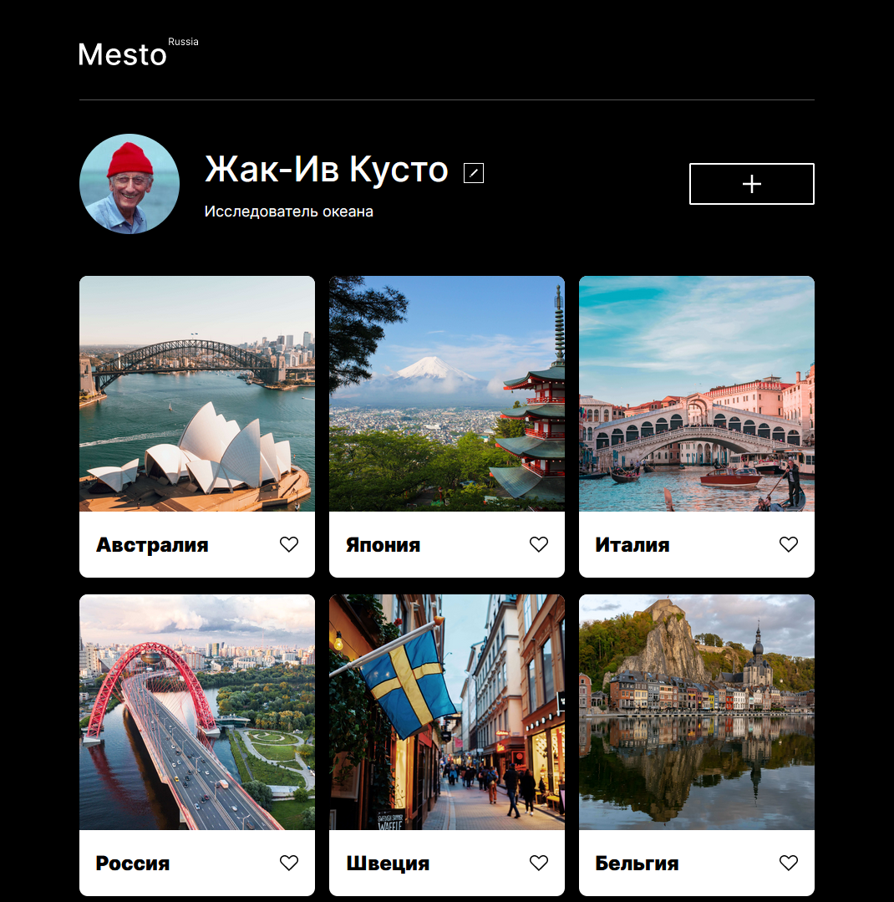

# Проект: Место

Mesto — это интерактивная страница, куда можно добавлять фотографии, удалять их и ставить лайки.

### Технологии

* HTML
* CSS
* JavaScript

### Дизайн

Дизайн сайта был разработан в Figma

**Figma**

* [Ссылка на макет в Figma](https://www.figma.com/file/2cn9N9jSkmxD84oJik7xL7/JavaScript.-Sprint-4?node-id=0%3A1)

[Mesto на GitHub Pages](https://egorsabyanin.github.io/mesto/)
